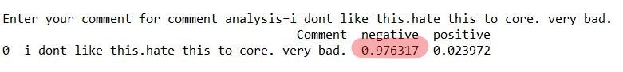

# Predicting sentiment of the text

We are trying to build two types of sentiment analysers (Text classifier) here. The below are the two type of sentiment analysers.  

  
1) **Binary classifier** which predicts any text as positive/negative ([bin_anal_pred](predict_binary.py))  
  
2) **Multinomilal classifier** which predicts a given text as 6 categories( "toxic", "severe_toxic", "obscene", "threat", "insult", "identity_hate" ) ([multi_anal_pred](predict_multi.py))  
  

## Training  
  

[bin_anal_train](bin_anal_train.py) trains binary text classifiers.  
  
[multi_anal_train](multi_anal_train.py) trains the model to predict out of six categories ("toxic", "severe_toxic", "obscene", "threat", "insult", "identity_hate").  
  

Both the models make of checkpointing and early_stopping to save the model's best weights onto the [/data/model/](/data/model/) as **best.hdf5**.  
  

 The Tokenizer object is dumped to [/data/model/](/data/model/)  as **tokenizer.pickle / sentiment_analyser_tokenizer.pickle** using the python pickle library.  

 The model is saved to [/data/model/](/data/model/) as a json file.  

 All the datasets with labels in txt,csv formats that are necessary for training are included in the [/data/input/](/data/input/).  
  

The ouput is saved to the [/output](/output).  
  

## Output of the binary sentiment analyzer
  
  
###### Positive 
  
  

###### Nogative 
